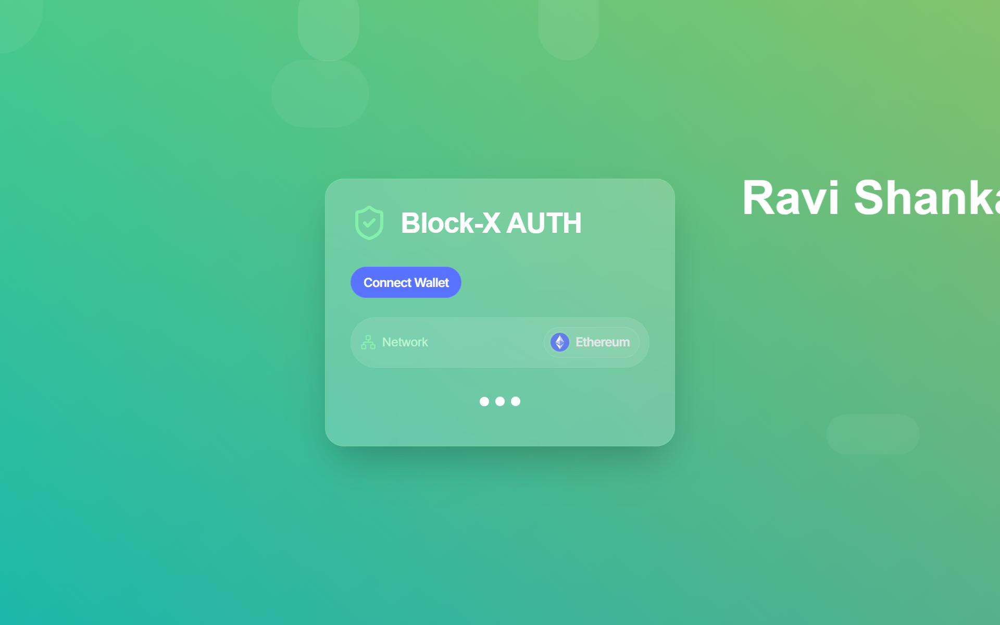
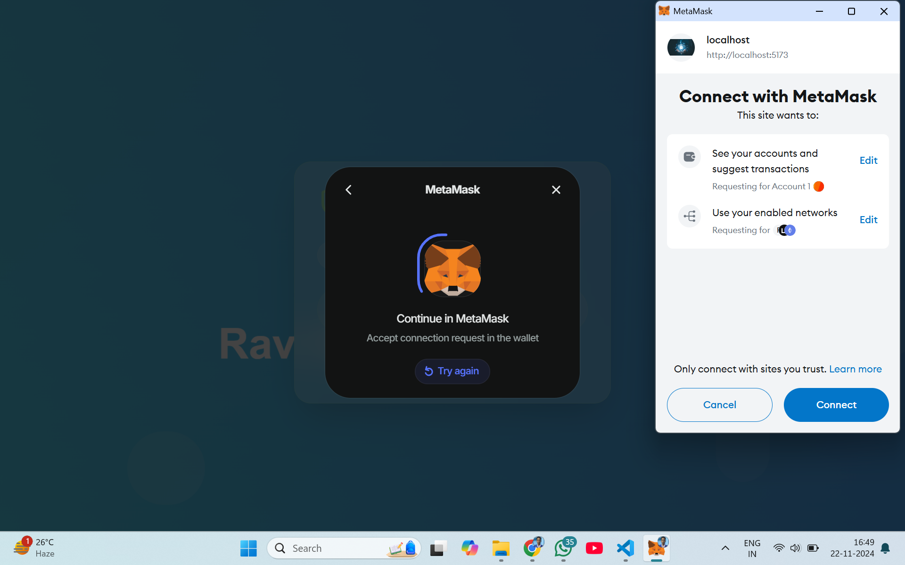
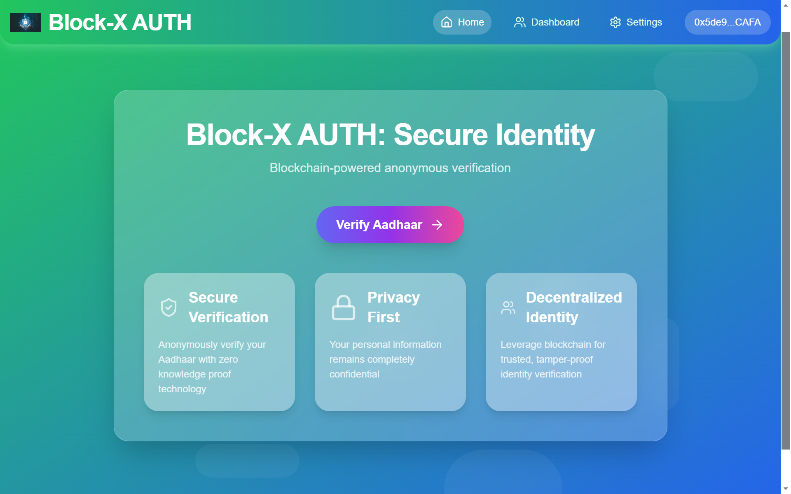

#  SecureConnect 
## Overview
This application integrates Wallet Connect for user authentication and uses the Anon Aadhaar SDK to verify Aadhaar citizenship securely with zero-knowledge proofs, ensuring privacy-preserving verification.

## Features
- **Wallet Connect Integration:** Secure user authentication via crypto wallet.
- **Anon Aadhaar SDK:** Privacy-preserving Aadhaar verification using zero-knowledge proofs.
- **Intuitive UI:** User-friendly interface for seamless interaction.
  
## How to use 
- **VITE_APP_WALLET_PROJECT_ID** = "".
- **Go https://cloud.reown.com/sign-in and get project id**.
  

 
## Usage
**Connect Wallet:** 
- Click on the "Connect Wallet" button to connect with wallet of your choice (eg. Metamask).
- Follow the prompts to connect your crypto wallet using Wallet Connect.

**Verify Aadhaar:**
- Toggle the details that you want share with application.
- Login using Anon Aadhaar by uploading secure QR of your UIDAI aadhaar document.
- Click on the "Continue" then on "Generate Anon Aadhaar Proof".
- The application will use the Anon Aadhaar SDK to perform zero-knowledge proof verification and will show results if verfied successfully.

## Technologies Used
- **React:** Frontend library for building user interfaces.
- **TypeScript:** For type checking and type safety.
- **Wallet Connect:** Crypto wallet SDK.
- **Anon Aadhaar:** zero-knowledge protocol that allows Aadhaar ID owners to prove their identity in a privacy preserving way.
- **Tailwind CSS/Daisy UI:** For intuitive and modern user interfaces.

